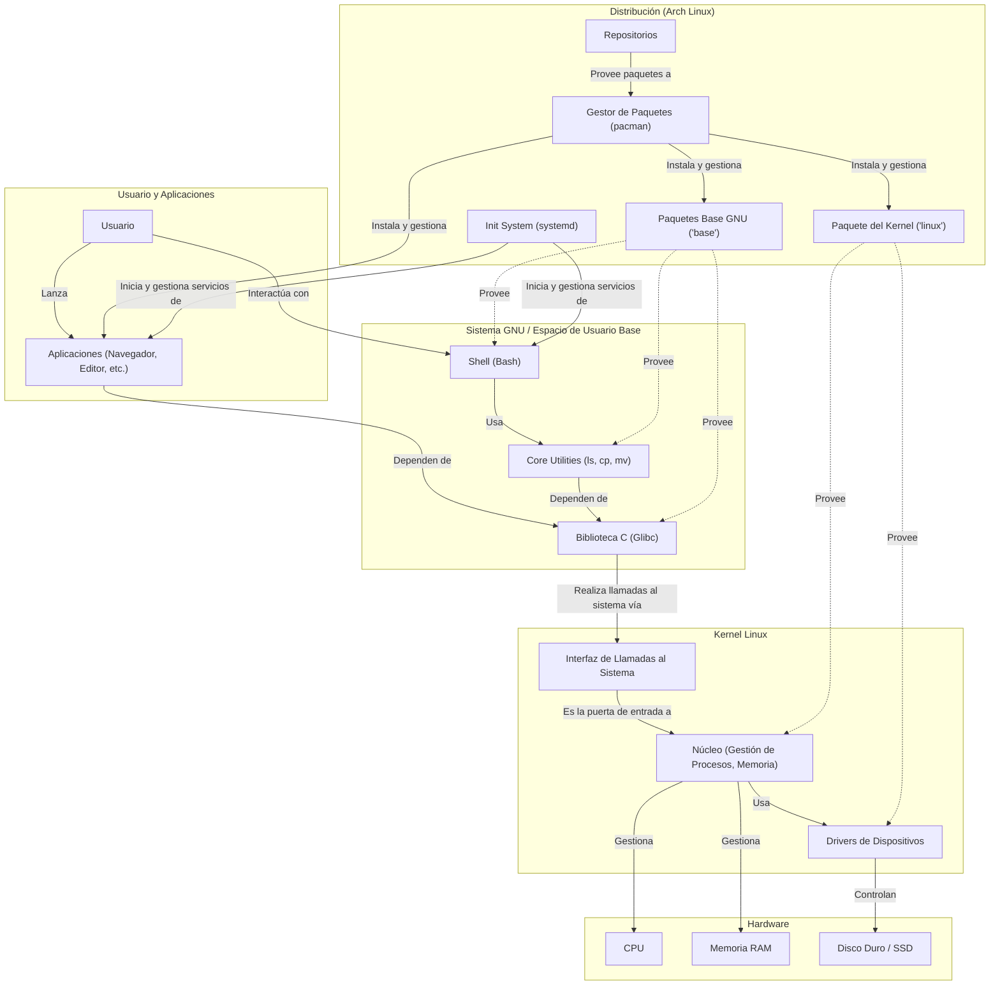
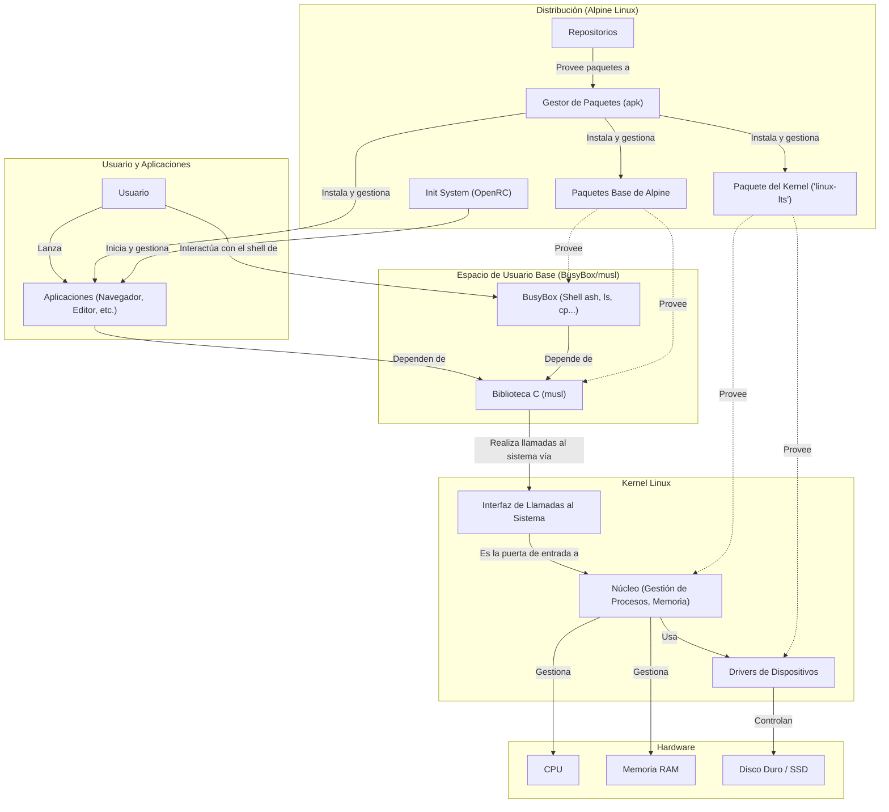

### **1. ¿Por Qué Enamorarse de Linux? La Recompensa de la Curiosidad**

La mayoría de nosotros interactuamos con la tecnología como pasajeros. Encendemos un dispositivo y este nos lleva a nuestro destino: una página web, un documento, una aplicación. Es un viaje cómodo, eficiente y diseñado para ser simple. Sin embargo, en este modelo, rara vez nos preguntamos cómo funciona el motor, qué tipo de combustible utiliza o por qué el conductor elige una ruta sobre otra. Somos, en esencia, usuarios pasivos de una tecnología que es una caja negra.

Linux nos ofrece una invitación radicalmente diferente: nos entrega las llaves y nos invita a sentarnos en el asiento del piloto. Aprender a usarlo, y más específicamente a construirlo, es dejar de ser un pasajero para convertirnos en los arquitectos de nuestra propia experiencia digital. La recompensa no es solo llegar a un destino, sino comprender el viaje completo. Este cambio de paradigma trae consigo beneficios tangibles: un **conocimiento** profundo de los fundamentos de la computación; una **libertad** real para modificar, optimizar y adaptar nuestro entorno; un **control** granular sobre cada proceso y cada dato; una **seguridad** que nace de la transparencia y no de la ofuscación; y finalmente, una **habilidad profesional** inmensamente valorada en una industria que se ejecuta, en su mayor parte, sobre servidores Linux.

### **2. El Alma y el Cuerpo: Kernel, GNU y la "Distro"**

Es un error común pensar en "Linux" como un único monolito. La realidad es una simbiosis, una historia de dos componentes que se encontraron en el momento perfecto. Por un lado, tenemos el **kernel Linux**, creado por Linus Torvalds. El kernel es el alma del sistema; es el núcleo de bajo nivel que gestiona los recursos más fundamentales del hardware: la CPU, la memoria RAM y los periféricos. Es un director de orquesta magistral, pero que no sabe tocar ningún instrumento por sí mismo. Es el motor, con toda su potencia, pero sin un coche alrededor.

Por otro lado, tenemos el **Proyecto GNU**, iniciado por Richard Stallman. Su objetivo era crear un sistema operativo completamente libre. Para cuando el kernel de Linux apareció, GNU ya había desarrollado casi todo el "cuerpo" de ese sistema: las utilidades esenciales (`ls`, `cp`, `mv`), la interfaz de línea de comandos (`bash`), el compilador (`gcc`) y un sinfín de otras herramientas que permiten a un usuario interactuar de forma significativa con la máquina. A GNU le faltaba un kernel libre y funcional.

La unión del kernel de Linux con el cuerpo de herramientas de GNU dio a luz al sistema operativo que hoy conocemos. Por eso, el término más preciso y respetuoso es **GNU/Linux**. Una **"distribución"** (distro) no es más que este conjunto (kernel + herramientas GNU) empaquetado por una comunidad o empresa, que añade un gestor de paquetes, un instalador, un entorno de escritorio y sus propias configuraciones para ofrecer una experiencia completa y coherente.
#### La Arquitectura en Acción: Un Mapa del Sistema
Para visualizar esta simbiosis de manera clara y entender cómo cada pieza encaja en el gran rompecabezas, hemos preparado el siguiente diagrama. Piensa en él como el mapa conceptual de tu vehículo: muestra cómo el motor (Kernel) se conecta con el chasis y los controles (GNU), y cómo la distribución (en este caso, Arch Linux) ensambla todo para que tú, el piloto, puedas tomar el control.

### **3. La Belleza de la Libertad y la Variedad de Distros**

La belleza del ecosistema GNU/Linux reside en su modularidad. La unión del kernel Linux y las herramientas GNU es la más común, pero no es una ley inmutable. Esta flexibilidad permite la existencia de sistemas altamente especializados como **Alpine Linux**. Alpine utiliza el kernel de Linux, pero reemplaza el "cuerpo" de GNU con alternativas minimalistas: en lugar de la librería C estándar de GNU (`glibc`), usa `musl`, que es mucho más ligera; y en lugar de las `coreutils` de GNU, implementa `BusyBox`, una única utilidad que contiene versiones reducidas de muchas herramientas. El resultado es un sistema increíblemente pequeño y seguro, ideal para contenedores. Esta capacidad de intercambiar componentes fundamentales es la razón por la que existe un universo de distribuciones. Cada una es una opinión sobre cómo debe ser un sistema operativo, diferenciándose principalmente en:
1. **El Gestor de Paquetes:** Cómo se instala y gestiona el software (`apt`, `dnf`, `pacman`).
2. **La Filosofía:** Su objetivo principal (estabilidad, innovación, simplicidad).
3. **El Modelo de Lanzamiento:** Si se actualiza en grandes versiones (`point release`) o de forma continua (`rolling release`).
#### Visualizando la Modularidad: El Mapa de Alpine Linux
Para ilustrar esta poderosa flexibilidad, el siguiente diagrama muestra cómo se reconfigura la arquitectura en un sistema como Alpine Linux. Observa cómo glibc y las coreutils de GNU han sido reemplazadas por musl y el multifacético BusyBox, resultando en un sistema más ligero y compacto.

### **4. Las 3 Grandes Familias de Linux**
Para no perdernos en la galaxia de distribuciones, podemos agruparlas en tres grandes linajes, cada uno con una personalidad muy marcada.

---
#### **La Familia Debian: Estabilidad a Prueba de Balas**
Es el linaje de la fiabilidad. Su rama stable es famosa por ser robusta como una roca, convirtiéndola en la reina de los servidores. Su lema no oficial podría ser "si funciona, no lo toques".
- **Filosofía:** Estabilidad, comunidad fuerte y software 100% libre como base.
- **Gestor de Paquetes:** apt (usando archivos .deb).
- **Ideal para:** Servidores, principiantes que buscan un sistema que "simplemente funcione", desarrolladores que valoran un entorno predecible.
- **Derivados Famosos:** **Ubuntu**, **Linux Mint**.
---
#### **La Familia Red Hat: Innovación Corporativa**
Proviene del mundo empresarial y su ADN es la tecnología de vanguardia y el soporte profesional. Es la fuerza motriz detrás de muchas tecnologías de nube y virtualización.
- **Filosofía:** Innovación, seguridad de nivel empresarial y ecosistema comercial.
- **Gestor de Paquetes:** dnf (usando archivos .rpm).
- **Ideal para:** Entornos corporativos, desarrolladores que trabajan con tecnologías de contenedores y nube, usuarios que quieren lo último de forma estable.
- **Derivados Famosos:** **Fedora** (su campo de pruebas comunitario), **CentOS Stream**, **Rocky**, **AlmaLinux**. 
---
#### **La Familia Arch: El Camino del Artesano**
Es la encarnación de la filosofía **"hazlo tú mismo" (DIY)**. Te entrega una base mínima y un manual de instrucciones, permitiéndote construir un sistema a medida, pieza por pieza.
- **Filosofía:** Control total del usuario, simplicidad a través de su principio **KISS (Keep It Simple, Stupid)**, personalización y estar siempre a la última (rolling release).
- **Gestor de Paquetes:** pacman.
- **Ideal para:** Usuarios intermedios/avanzados, entusiastas que quieren entender cómo funciona su sistema y cualquiera que desee un SO 100% a medida.
- **Derivados Famosos:** **Manjaro**, **EndeavourOS**.
### **5. ¿Y Por Qué Arch para Este Viaje? Nuestra Herramienta de Aprendizaje**

Ahora que conocemos los grandes linajes, la pregunta es natural: ¿por qué elegir el camino del artesano, el camino de Arch? La respuesta es a la vez personal y pedagógica. Mi propio viaje en Linux, como el de muchos, comenzó con sistemas muy amigables como Ubuntu y Pop!_OS, pasando por Manjaro para probar el mundo Arch de forma sencilla. Sin embargo, sentía una curiosidad profunda por entender qué ocurría "debajo del capó". Así que me propuse instalar Arch puro como un reto personal.

Fueron horas de leer documentación, de enfrentarme a una pantalla negra con un cursor parpadeante. Pero la sensación de ver arrancar por primera vez ese sistema, un sistema construido enteramente por mis propias manos y decisiones, fue increíblemente reveladora. No solo había instalado un SO, lo había comprendido.

Aquí reside la magia de Arch, guiada por su filosofía **"KISS" (Keep It Simple, Stupid)**. Esto no significa "fácil", sino "libre de complejidad innecesaria". Arch te entrega una base mínima y cada componente, desde el entorno de escritorio hasta la utilidad más pequeña, es una elección consciente. El sistema solo tiene lo que tú quieres que tenga. Por eso he elegido Arch para esta presentación: es la herramienta de aprendizaje perfecta. Su instalación no es un simple asistente de "siguiente, siguiente, finalizar"; es una lección interactiva de la anatomía de cualquier sistema GNU/Linux. Nos obliga a entender cada pieza para poder ensamblarla. Al final del proceso, no solo te habrás sentado en el asiento del piloto que te prometí al principio; habrás construido el vehículo con tus propias manos. Ese conocimiento es el verdadero objetivo de hoy.
### Es momento de entender la estructura de este curso [[Módulo transitorio - el Plano de Construcción - Nuestro Viaje módulo a módulo]]

---
### Enlaces Relacionados
- [[Módulo transitorio - el Plano de Construcción - Nuestro Viaje módulo a módulo]] - Visión general del curso completo
- [[Módulo 1 - El Taller Temporal (El entorno en vivo)]] - Siguiente paso: preparación del entorno
- [[Virtualizadores Computadoras dentro de tu computadora]] - Opciones de virtualización para practicar

