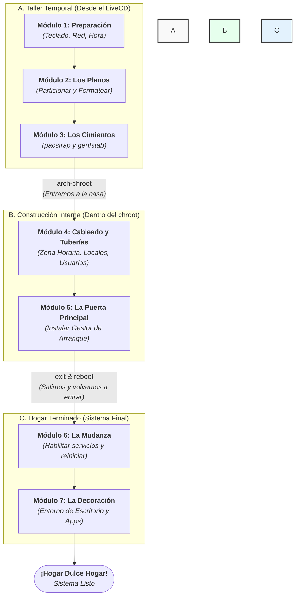

Todo gran proyecto empieza con un plano. Antes de poner la primera piedra en nuestro disco duro, vamos a estudiar el nuestro. Este es el mapa de nuestro viaje, las siete fases que nos llevarán de un disco vacío a un sistema Arch Linux funcional y a medida, construido por y para nosotros.
Para tener una visión de pájaro de todo el proyecto, este es nuestro flujo de construcción. Observa cómo pasamos de trabajar desde fuera (el taller del LiveCD) a trabajar desde dentro (el chroot), para finalmente mudarnos a nuestro sistema terminado.

---
#### **[[Módulo 1 - El Taller Temporal (El entorno en vivo)]]**
**La Analogía:** Antes de construir la casa, montamos un taller temporal en el terreno. El entorno en vivo (LiveCD) es precisamente eso: un sistema operativo completo que se ejecuta desde la memoria RAM, sin tocar el disco. Desde este taller, preparamos nuestras herramientas (configuramos el teclado), confirmamos que tenemos acceso a los materiales (verificamos la conexión a internet) y sincronizamos los relojes para que todo el equipo trabaje al unísono.
- **Herramientas Clave:** LiveCD, loadkeys, ping, timedatectl.
---
#### **[[Módulo 2 - El Terreno y los Planos (Particionado y Formateo)]]**
**La Analogía:** Ahora sí, trabajamos sobre el terreno: nuestro disco duro. Primero, dibujamos los planos, definiendo con precisión cada habitación. Estas serán nuestras particiones: los cimientos (/), nuestras pertenencias (/home), la puerta de entrada principal (EFI) y la bodega de emergencias (swap). Una vez dibujado, preparamos la tierra (formateamos) para que sea fértil y esté lista para recibir la estructura.
- **Herramientas Clave:** cfdisk/fdisk (el arquitecto), mkfs (el preparador de tierra), mkswap (el constructor de la bodega).
---
#### **[[Módulo 3 - Los Cimientos (Instalación del Sistema Base)]]**
**La Analogía:** Con los planos listos y el terreno preparado, llega el equipo de construcción. pacstrap es la grúa que instala los cimientos de nuestra casa. Descarga e instala el corazón del sistema (el kernel de Linux), las paredes maestras (los paquetes base) y las herramientas fundamentales. Al terminar, usamos genfstab para crear la "dirección postal" oficial, asegurando que el sistema siempre sepa dónde está cada habitación.
- **Herramientas Clave:** pacstrap (la grúa), genfstab (el registro de la propiedad).
---
#### **Fase 4: Amueblando desde Dentro (Configuración en Chroot)**
**La Analogía:** Este es el momento mágico en que entramos por primera vez a nuestra casa a medio construir. El comando chroot nos transporta dentro del nuevo sistema. Desde aquí, instalamos el cableado y las tuberías: definimos su ubicación en el mundo (zona horaria), el idioma que se hablará (locales), le damos un nombre a la casa (hostname) y forjamos las primeras llaves para el administrador (root) y para nosotros (nuestro usuario).
- **Herramientas Clave:** arch-chroot, ln -sf, locale-gen, passwd, useradd.
---
#### **Fase 5: La Puerta Principal (Instalación del Gestor de Arranque)**
**La Analogía:** Nuestra casa ya es habitable, pero es invisible e inaccesible desde la calle. El gestor de arranque (GRUB) es la puerta principal, el timbre, la cerradura y la llave, todo en uno. Lo instalamos y configuramos para enseñarle al ordenador cómo encontrar y abrir nuestro nuevo sistema cada vez que se enciende. Sin él, estaríamos encerrados fuera.
- **Herramientas Clave:** GRUB, grub-install, grub-mkconfig.
---
#### **Fase 6: La Inspección Final y la Mudanza (Finalización)**
**La Analogía:** El trabajo de construcción ha terminado. Damos las órdenes finales para que los servicios básicos, como la conexión a internet, se activen automáticamente al entrar (systemctl enable). Después, recogemos las herramientas y limpiamos el taller temporal (umount, exit). El comando reboot es el emocionante momento de la mudanza: salimos del taller y entramos por primera vez por la puerta principal como residentes.
- **Herramientas Clave:** systemctl enable, umount, exit, reboot.
---
#### **Fase 7: La Decoración (Post-Instalación)**
**La Analogía:** ¡Ya estamos dentro! La estructura es sólida y funcional, pero ahora viene la mejor parte: hacerla nuestra. En esta fase elegimos el color de las paredes y el estilo de los muebles, instalando un entorno de escritorio (como GNOME o KDE Plasma). También nos aseguramos de que las ventanas tengan los mejores cristales (instalando los drivers gráficos) y ajustamos los últimos detalles para que nuestra nueva casa sea un hogar perfecto.
- **Herramientas Clave:** pacman, Entornos de Escritorio, Controladores Gráficos (mesa, nvidia).
